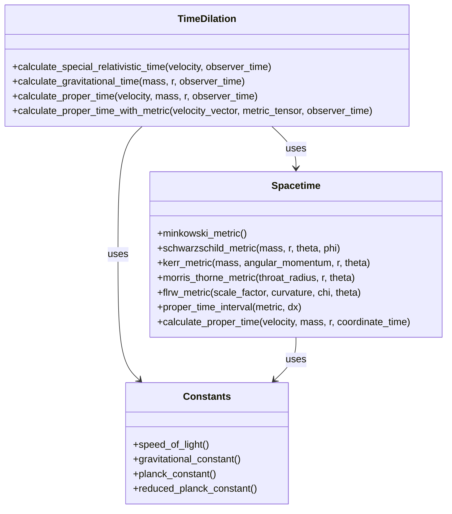
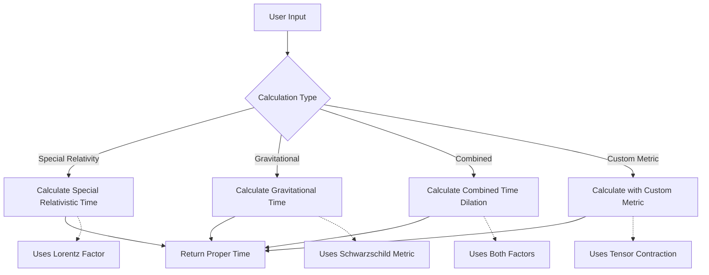
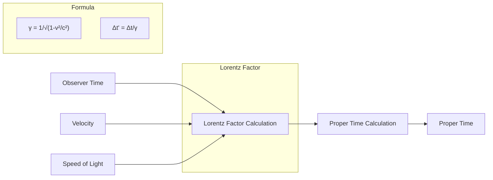
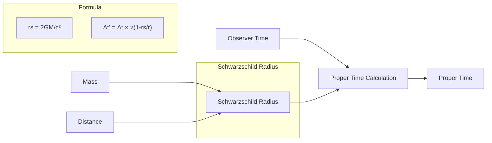
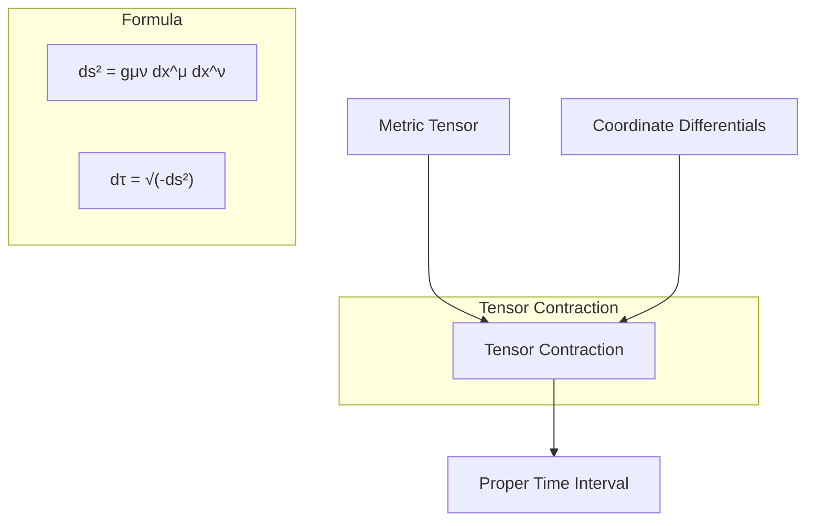
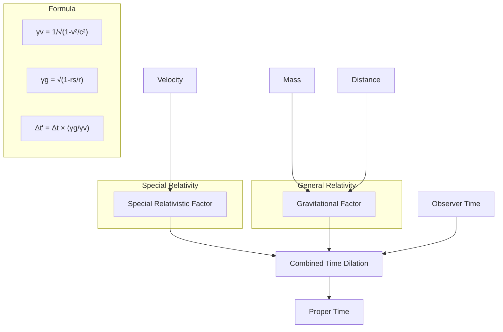

# Relativity Calculator Diagrams

This document contains diagrams that explain the structure and concepts of the LightBubble Relativity Calculator.

## Module Structure

## Calculation Flow

## Special Relativity Time Dilation

## Gravitational Time Dilation

## Curved Spacetime Calculation

## Combined Time Dilation Effects

